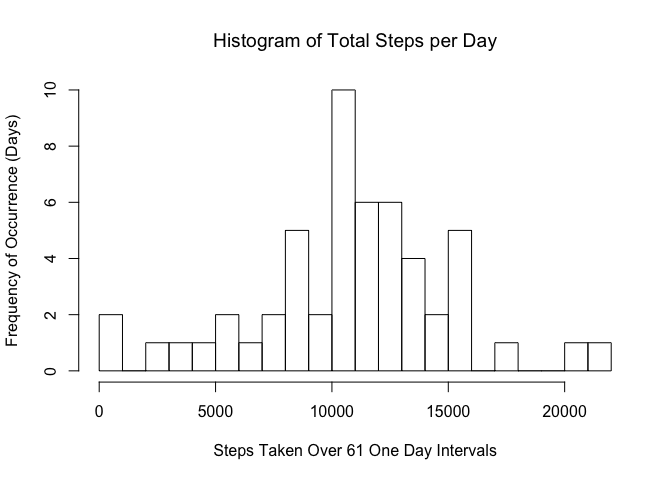
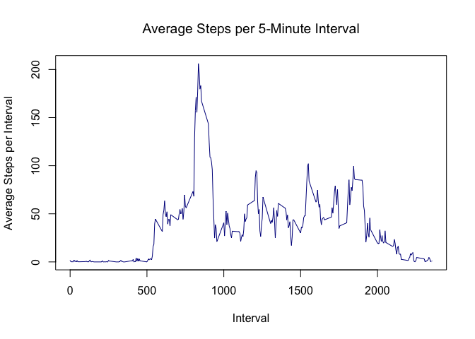
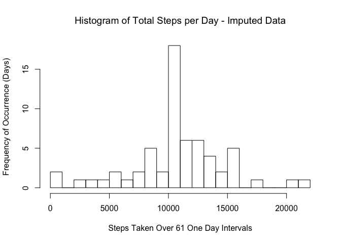
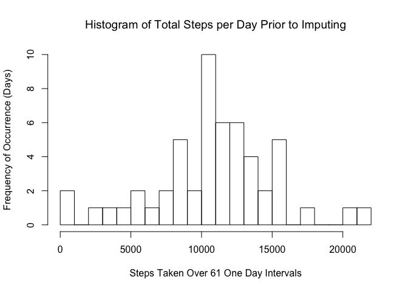
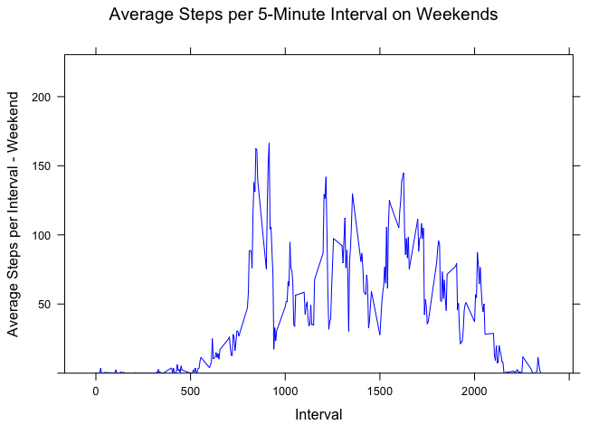
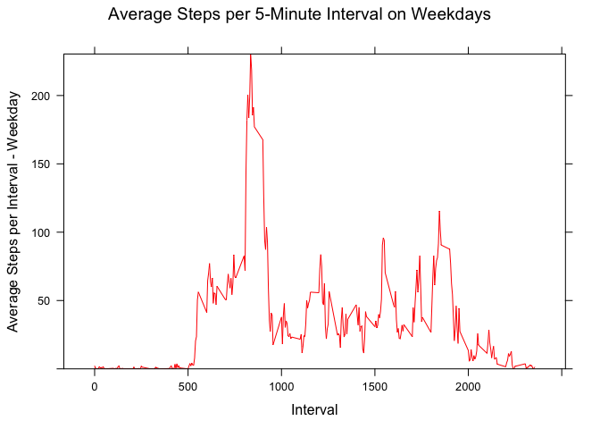

## Loading and preprocessing the data
Loading the data is a fairly straightforward process. We will also explore the dataset columns and implement any necessary transformations.

```r
# Assuming your working directory contains activity.zip, as the main directory 
# of the course repo does. Unzipping produces one file: activity.csv.
unzip("./activity.zip")
activity <- read.csv("./activity.csv")

# Now, let's find out about our dataset:
str(activity)
```

```
## 'data.frame':	17568 obs. of  3 variables:
##  $ steps   : int  NA NA NA NA NA NA NA NA NA NA ...
##  $ date    : Factor w/ 61 levels "2012-10-01","2012-10-02",..: 1 1 1 1 1 1 1 1 1 1 ...
##  $ interval: int  0 5 10 15 20 25 30 35 40 45 ...
```

```r
# Since step and interval columns are integer class, they will not be changed.
# The date column will be more helpful if formatted as date, rather than as 
# a factor.
activity$date <- as.Date(as.character(activity$date), "%Y-%m-%d")

# Rerunning str() to verify the change in our dataset.
str(activity)
```

```
## 'data.frame':	17568 obs. of  3 variables:
##  $ steps   : int  NA NA NA NA NA NA NA NA NA NA ...
##  $ date    : Date, format: "2012-10-01" "2012-10-01" ...
##  $ interval: int  0 5 10 15 20 25 30 35 40 45 ...
```


## What is mean total number of steps taken per day?

To get the mean total number of steps per day, we will need to aggregate the steps per interval as a sum into days, using the Date column. We can then use this new dataframe to create a histogram of steps per day and report the mean and median of steps taken per day. Many intervals and some whole days have the value 'NA' recorded for number of steps.


```r
# Aggregate the steps column, summing it by date, then call str to demonstrate 
# the structure of the new dataframe.
activity_by_date <- aggregate(x = activity$steps, by = list(day = activity$date), FUN = "sum")
str(activity_by_date)
```

```
## 'data.frame':	61 obs. of  2 variables:
##  $ day: Date, format: "2012-10-01" "2012-10-02" ...
##  $ x  : int  NA 126 11352 12116 13294 15420 11015 NA 12811 9900 ...
```

```r
# Use the new dataframe to create a histogram and report the mean and median steps per day.
hist(activity_by_date$x, breaks = 20, 
     main = "Histogram of Total Steps per Day", 
     xlab = "Steps Taken Over 61 One Day Intervals", 
     ylab = "Frequency of Occurrence (Days)")
```

<!-- -->

```r
summary(activity_by_date$x)
```

```
##    Min. 1st Qu.  Median    Mean 3rd Qu.    Max.    NA's 
##      41    8841   10765   10766   13294   21194       8
```
Note the mean and median values of steps per day, along with eight days reported as 'NA'. The histogram reflects reporting of 53 days with values for steps per day. Besides observing the quartiles, we can observe that 45 of the 53 days fall between 5,000 and 16,000. Which days of the week are more likely to reflect a low number of steps per day?

## What is the average daily activity pattern?

To examine daily activity patterns, let's first aggregate the activity dataset by daily 5 minute interval. The average number of steps is plotted for a given interval from the entire 61 days, just as was done above by day.


```r
# Aggregate the activity dataset by interval, then check the structure of the new dataframe.
activity_no_na <- activity[complete.cases(activity), ]
activity_by_interval <- aggregate(x = activity_no_na$steps, by = list(interval = activity_no_na$interval), FUN = "mean")
str(activity_by_interval)
```

```
## 'data.frame':	288 obs. of  2 variables:
##  $ interval: int  0 5 10 15 20 25 30 35 40 45 ...
##  $ x       : num  1.717 0.3396 0.1321 0.1509 0.0755 ...
```

```r
# Time series plot the activity_by_interval dataframe.
plot(x = activity_by_interval$interval, 
     y = activity_by_interval$x, 
     col = "darkblue",
     type = "l", 
     ylim = c(min(activity_by_interval$x), max(activity_by_interval$x)),
     main = "Average Steps per 5-Minute Interval",
     xlab = "Interval",
     ylab = "Average Steps per Interval")
```

<!-- -->

Clearly, there is a spike between roughly 800 and 950, perhaps representing a morning exercise session. Now let's find the interval with the maximum mean number of steps and what that value is.

```r
activity_by_interval$interval[activity_by_interval$x == max(activity_by_interval$x)]
```

```
## [1] 835
```

```r
activity_by_interval$x[activity_by_interval$x == max(activity_by_interval$x)]
```

```
## [1] 206.1698
```
So at interval 835, the maximum mean step value of 206.1698 occurs.

## Imputing missing values

Missing values are revealed by a simple, visual inspection of the activity dataset. Further inspection of the activity_by_date dataset reveals that there are whole days where every interval has 'NA' for the step value, perhaps representing a day when the monitor was not worn. Individual 'NA' intervals can be explained by sleep, showering, or other activities for which the subject is still or not wearing the monitor. Taking the summary of the activity dataset reveals, among other statistics, a significant number of 'NA' values in the 'steps' column.


```r
summary(activity)
```

```
##      steps             date               interval     
##  Min.   :  0.00   Min.   :2012-10-01   Min.   :   0.0  
##  1st Qu.:  0.00   1st Qu.:2012-10-16   1st Qu.: 588.8  
##  Median :  0.00   Median :2012-10-31   Median :1177.5  
##  Mean   : 37.38   Mean   :2012-10-31   Mean   :1177.5  
##  3rd Qu.: 12.00   3rd Qu.:2012-11-15   3rd Qu.:1766.2  
##  Max.   :806.00   Max.   :2012-11-30   Max.   :2355.0  
##  NA's   :2304
```

Note that there are 2304 'NA' values, taken as a fraction of the total values:


```r
2304 / length(activity$steps)
```

```
## [1] 0.1311475
```

we see that 'NA' values represent roughly 13% of the column. In order to get a good picture of the wearer's daily behavior, these missing values are important. One rudimentary method, given the existence of the activity_by_interval dataframe which gives the average number of steps per 5-minute interval for all 288 intervals comprising a day, would be to replace each 'NA' value in the activity dataframe with its corresponding mean from the activity_by_interval dataframe. Later, perhaps, we can increase the sophistication of the data imputation scheme if other factors show themselves to be important.


```r
# Create a new dataframe so as not to adulterate the original data.
activity_imp <- activity
# Check every step value for 'NA' and replace the moissing values with the 
# corresponding mean, using the activity_imp$interval value to index the 
# activity_by_interval dataframe.
for (i in 1:length(activity_imp$steps)){
    if (is.na(activity_imp[i, 1])){
        activity_imp[i, 1] <- activity_by_interval[activity_by_interval$interval == activity_imp[i, 3], 2]
    }
}
summary(activity_imp)
```

```
##      steps             date               interval     
##  Min.   :  0.00   Min.   :2012-10-01   Min.   :   0.0  
##  1st Qu.:  0.00   1st Qu.:2012-10-16   1st Qu.: 588.8  
##  Median :  0.00   Median :2012-10-31   Median :1177.5  
##  Mean   : 37.38   Mean   :2012-10-31   Mean   :1177.5  
##  3rd Qu.: 27.00   3rd Qu.:2012-11-15   3rd Qu.:1766.2  
##  Max.   :806.00   Max.   :2012-11-30   Max.   :2355.0
```

Note that the mean, median, and max are the same for the new, imputed dataframe for total daily steps values, and that the 'NA' values are now missing. The other columns were left as is. Interestingly, the 3rd quartile has moved from 12.00 to 27.00.


```r
# Use the imputed dataframe to create a histogram and report mean and median steps per day.
activity_imp_by_date <- aggregate(x = activity_imp$steps, by = list(day = activity_imp$date), FUN = "sum")
hist(activity_imp_by_date$x, breaks = 20, 
     main = "Histogram of Total Steps per Day - Imputed Data", 
     xlab = "Steps Taken Over 61 One Day Intervals", 
     ylab = "Frequency of Occurrence (Days)")
```

<!-- -->


```r
# Use the new dataframe to create a histogram and report and report mean and median steps per day.
hist(activity_by_date$x, breaks = 20, 
     main = "Histogram of Total Steps per Day Prior to Imputing", 
     xlab = "Steps Taken Over 61 One Day Intervals", 
     ylab = "Frequency of Occurrence (Days)")
```

<!-- -->

Comparing the original activity histogram, we see that the spike between 10,000 and 11,000 is more prevalent with the imputed data. The surrounding values are closer to one another in magnitude. The 10 daya that fell between 10,000 and 11,000 total steps has now become more like 18 days, if our imputation method is sound. Meanwhile, several of the surrounding step values have decreased in frequency by a day or more.

## Are there differences in activity patterns between weekdays and weekends?

The variance shown by both histograms above suggests a difference in routine, perhaps brought about by differences in weekday versus weekend activities. To explore this hypothesis, we can add a column to the activity_by_date dataframe, reflecting whether a given date falls on a weekday or a weekend. Mean total weekday steps per interval can be plotted versus mean total weekend day steps per interval to demonstrate a possible pattern.


```r
# Use the dplyr library to add a factor column to the activity_imp dataframe 
# denoting day of the week.
library(dplyr)
activity_imp_day <- mutate(activity_imp, day = weekdays(activity_imp$date))
# Convert days of the week into a weekend/ weekday, 2-level factor.
weekend <- c("Saturday", "Sunday")
activity_imp_day[activity_imp_day$day %in% weekend, ]$day <- "weekend"
activity_imp_day[activity_imp_day$day != "weekend", ]$day <- "weekday"
activity_imp_day$day <- as.factor(activity_imp_day$day)
# Aggregate the activity_imp_day dataframe by interval, producing a dataframe 
# with the mean steps per day for each interval, separated by weekend or
# weekday designation.
activity_by_interval_day <- aggregate(x = activity_imp_day$steps, 
                                        by = list(interval = activity_imp_day$interval,
                                                  day = activity_imp_day$day), 
                                        FUN = "mean")
# Time series plots compare the activity_by_interval dataframe weekend subset to 
# the weekday subset. Save them to p1 and p2 for later printing. In conjunction 
# with 'fig.keep = TRUE' above, in the code chunk tag, both plots will be 
# printed in the knitted document with only 'print(p2)' between them. 
library(lattice)
activity_by_interval_day$day <- as.character(activity_by_interval_day$day)
p1 <- xyplot(x ~ interval,
       data = activity_by_interval_day[activity_by_interval_day$day == "weekend", ],
       col = "blue",
       type = "l",
       ylim = c(min(activity_by_interval_day$x), max(activity_by_interval_day$x)),
       main = "Average Steps per 5-Minute Interval on Weekends",
       xlab = "Interval",
       ylab = "Average Steps per Interval - Weekend")
p2 <- xyplot(x ~ interval,
       data = activity_by_interval_day[activity_by_interval_day$day == "weekday", ],
       col = "red",
       type = "l",
       ylim = c(min(activity_by_interval_day$x), max(activity_by_interval_day$x)),
       main = "Average Steps per 5-Minute Interval on Weekdays",
       xlab = "Interval",
       ylab = "Average Steps per Interval - Weekday")
print(p1)
```

<!-- -->

```r
print(p2)
```

<!-- -->

We see that there is definitely a difference in the weekday versus weekend pattern. While the subject seems to rise immediately after the 500th interval, producing an immediate spike at approximately the same interval every weekday morning, there is a much more gradual move toward activity on weekend mornings, as one might expect if the subject were not getting ready for work immediately upon rising. This might also be explained by the subject not setting an alarm on weekend days, yet still rising shortly after the alarm would go off, by habit. Similarly, the spike of steps per interval on weekdays between approximately the 800th and 925th intervals is much more pronounced on weekdays. Let's compare these maximums.


```r
print(c(max(activity_by_interval_day[activity_by_interval_day$day == "weekday", ]$x ),
        max(activity_by_interval_day[activity_by_interval_day$day == "weekend", ]$x)))
```

```
## [1] 230.3782 166.6392
```

On weekends, we see that the mean steps per interval for what might be the morning commute, or morning exercises, is approximately 230 while on weekends, this value is approximately 167. Perhaps the subject rides a bicycle to work or engages in a morning run on weekdays, goes places or exercises less often on weekday mornings. 


```r
print(c(mean(activity_by_interval_day[activity_by_interval_day$day == "weekday" &
                                      activity_by_interval$interval >= 1000 &
                                      activity_by_interval$interval <= 2000, ]$x),
        mean(activity_by_interval_day[activity_by_interval_day$day == "weekend" & 
                                      activity_by_interval$interval >= 1000 &
                                      activity_by_interval$interval <= 2000, ]$x)))
```

```
## [1] 43.4310 70.8426
```

Conversely, we see that during the 1000 to 2000 interval range, mean step activity is higher, at approximately 71 on weekends, versus approximately 43 on weekdays. The subject engages, perhaps, in a sedentary job. 

Finally, we see a much more pronounced curtailment of step activity after the 2000 interval on weekdays versus continued activity until the 2100 to 2150 interval on weekends. The subject is more active just before bedtime on weekends, while it appears that there is a somewhat defined bedtime on weekdays with, perhaps, Friday night activity increasing this mean value.
